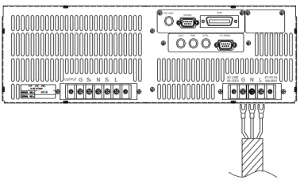
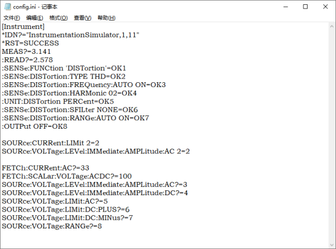

** **摘  要

机务维修中航空电子设备维修的效率不断提高，其中自动化测试功不可没，在对航电组件的进行内场测试时，电子设备拆卸难度大，电源移动不方便，操作不灵活，测试过程复杂，人工测量操作不稳定等缺点。极大的对飞机维修效率进行影响，近几年随着民航机队数量的增长，维修任务数量也随之攀升。

基于需要为组件提供交流电源供电，并测试在不同供电电压时组件是否能够正常工作；为了能够实现自动测试，需要对交流电源实现远程控制，为了实现更为集成高效的自动化测试，设计了基于虚拟仪器的交流电源远程控制软件。

首先该软件拥有基本的交流电源参数控制功能，其次可以对电源设备的工作步骤进行监测功能，也能实现输出波形的可视化控制功能，还可通过图和表的形式实现测量数据可视化记录，能够在PC端，远程对交流电源进行控制，用于航电组件的自动测试系统中，从而实现复杂性的电源输出控制并进行参数记录的难题。

** ** **关键词** ：虚拟仪器；交流电源；远程控制；数据可视化**

**A****bstract**

The efficiency of avionics maintenance in maintenance is constantly improving, among which the automatic test is indispensable. When the avionics components are tested in the infield, the electronic equipment is difficult to disassemble, the power supply is not convenient to move, the operation is not flexible, the test process is complex, and the manual measurement operation is not stable. It has a great impact on aircraft maintenance efficiency. In recent years, with the growth of the number of civil aviation fleet, the number of maintenance tasks has also increased.

Based on the need to provide AC power supply for components, and test whether components can work normally under different supply voltage; in order to achieve automatic testing, it is necessary to realize remote control of AC power supply. In order to achieve more integrated and efficient automatic testing, a remote control software of AC power supply based on virtual instrument is designed.

Firstly, the software has the basic function of AC power parameter control. Secondly, it can monitor the working steps of the power equipment, realize the visual control function of the output waveform, and realize the visual recording of the measurement data in the form of graphs and tables. It can control the AC power supply remotely at the PC end and be used in the automatic test system of the avionics components It is difficult to realize complex power output control and record parameters.

**Key Words:** Virtual Instrument; AC Power Supply; Remote Control; Data Visualization

目  录

[第**1**章**  **绪论**	**1](#_Toc32519)

[1.1**  **课题的研究背景及意义**	**1](#_Toc12128)

[1.**2**  本文的研究内容**	**1](#_Toc19352)

[第**2**章  程控交流电源原理	**2**](#_Toc6426)

[2.1**  **概述**	**2](#_Toc3138)

[2.**2**  电源输入输出连接**	**2](#_Toc6444)

[2.**3**  电源功能介绍**	**3](#_Toc4860)

[2.**4**  远程输入编程**	**4](#_Toc2262)

[2.4.1  输入编程硬件连接	**4**](#_Toc28313)

[2.4.2  仪器指令用语SCPI	**5**](#_Toc21453)

[第**3**章  系统方案设计原理	**6**](#_Toc23398)

[3.1**  **系统方案设计原理**	**6](#_Toc28401)

[3.2  系统软件界面设计**	**6](#_Toc1405)

[3.3**  **电源设备调试模块设计**	**7](#_Toc7616)

[3.3.1  兼容更多交流电源品牌和种类的原理	**8**](#_Toc4846)

[3.3.2**  **扩展交流电源控制软件支持的原理**	**9](#_Toc17522)

[3.3.3**  **监测软件界面运作流程的原理**	**9](#_Toc23532)

[3.4**  **电源基础功能模块设计**	**10](#_Toc13278)

[3.4.1  电源输出配置模块的工作原理**	**10](#_Toc10651)

[3.4.1  电源参数配置模块的工作原理**	**11](#_Toc1430)

[3.**5**  电源高级功能模块设计**	**11](#_Toc22593)

[3.**6** ** **测量数据模块设计**	**12](#_Toc4574)

[3.6.1  输出波形测量模块的工作原理**	**13](#_Toc24535)

[3.6.2  测量数据记录模块的工作原理**	**14](#_Toc5743)

[第**4**章  软件测试	**15**](#_Toc7196)

[4.1**  **测试原理**	**15](#_Toc22815)

[4.1.1**  **SCPI指令命令行模块**	**15](#_Toc23250)

[4.1.2** ** 串口协议配置模块**	**16](#_Toc22450)

[4.1.3** ** 万用表测量模块**	**16](#_Toc5784)

[4.1.4** ** 模拟仪表软件模块**	**16](#_Toc18175)

[4.**2**  基础功能模块测试步骤**	**18](#_Toc1392)

[4.2.1  测试方法及结果（连接仪器测试）**	**18](#_Toc22110)

[4.2.2.  测试方法及结果（连接虚拟仪器测试）**	**20](#_Toc3394)

[4.**3**  高级功能模块测试步骤**	**20](#_Toc16446)

[4.**4**  测量功能模块测试步骤**	**21](#_Toc25155)

[第**5**章  结论	**23**](#_Toc17785)

[参考文献	](#_Toc4469)24

[致  谢	**25**](#_Toc6230)

[附录**A**：程序清单	2](#_Toc450285841)6

[附录**B**：外文翻译资料	26](#_Toc450285843)

# [第1章]()  绪论

## [1.1]()  课题的研究背景及意义

巨大的中国机队规模增长支撑者着民航维修市场规模的快速增长，在高效维修需求环境下，人工测试的缺点渐渐暴露出来，自动化测试工具的优点渐渐显现出来。

自动化测试的较好的可靠性、稳定性、测量精确性、以及较少的人为干预因素成为了维修厂为保证产品质量而采取的一种最为有效的控制手段。同样，自动测试方式也使得机务人员从长时间的乏味的机械动作中解放出来了，自动化测试降低了成本，并且极大提高了测试的效率 ^[1]^ 。^^

IT技术的发展，让数据采集和数据分析变得更加容易，近10年来出现了实时监控方式和预测性维修方式，并快速发展了起来。预测性维修是利用飞机上的传感器和计算机以及地面设备，替代通过拆解和目测检查进行的维护工作，是利用计算机为飞机或零部件体检。这种方式可以降低成本，缩短飞机的停场时间，得到了制造商、航空公司、维修企业甚至一些咨询公司的高度重视，他们均有开发成功的预测性维修系统在飞机维修工作中应用，并且在持续开发升级更全面预测更准确的的系统。实时监控方式是利用飞机上的ACMS系统及ACARS系统将飞机实时数据传回地面基站，地面基站通过计算机对数据进行实时分析，将飞机故障展现在维修监控人员面前，以便于提前准备应对，大大缩短了维修准备时间，对保障飞行安全和航班正点作用明显 ^[2]^ 。

在对航电组件的进行内场测试时，需要为组件提供交流电源供电，并测试在不同供电电压时组件是否能够正常工作，为了能够实现自动测试，需要对交流电源实现远程控制，进而集成到自动测试系统中。

## [1.]()2  本文的研究内容

本课题基于虚拟仪器技术，设计一套控制软件，能够在PC端，远程对交流电源进行控制，实现按照指定参数输出电压值等功能，并能够测量工作电流值；用于航电组件的自动测试系统中。

软件与硬件连接使用RS232接口实现计算机和程控交流电源的通信，完成对程控交流电源的参数设置，输出控制和参数测量。详细介绍了控制系统的设计思路、组成，实现方法和测试步骤。经过实际测试与应用，该控制系统运行可靠具有一定的实用性和推广应用价值。

# [第2章  ]()程控交流电源原理

## [2.1  ]()概述

实验使用的S7405/S7410/S7415/S7420系列为高效能交流电源供应器，提供低失真的正弦波输出及电源准确性的量测。DSP微处理器产生准确，稳定的输出电压与频率。PWM架构功率级允许视在功率进入负载。前面板有旋转式脉冲产生器（RPG）及键盘控制可设定输出电压及频率。LCD提供给用户仪器的完整操作状态。可经GPIB总线或RS-232C串行端口来完成远距编程 ^[3]^ 。

图2-1 电源后面板说明

## [2.]()2  电源输入输出连接

输入接头板位于仪器后面板上。电源线必须为三条导线且至少额定85°C。电源线输入必须有额定电流大于或等于交流电源供应器的最大额定电流。

连接步骤为：

1. 从交流电源供应器的背面拆下安全外壳。
2. 接上电源线至交流电源供应器的接头板。

(1) 绿色或绿/黄色金属线接至“G”端子。

(2) 白色或蓝色金属线接至“N”端子。

(3) 黑色或棕色金属线接至“L”端子。

3. 滑动安全外壳覆盖于交流电输入接线条（排），且确定外壳有两个螺丝。

输出接头板位于交流电源供应器的后侧。负载连接至“N”及“L”输出端子。当输出电压含有直流电源时，输出端子“L”为“+”端子，“N”为“-”端子。为符合安全需求，安全外壳必须拴紧。至负载的连接线径必须够大，从而当进行输出电流时将不会过热。

图2-2 电源输入连接

图2-3 输出和遥测连接

## 2.3  电源功能介绍

电源配置功能包括CHOICE PAGE中的SETUP、CONF、OUTPUT、MANUAL CALI、LIST、PULSE、STEP、HAR、SYN、INTERHAR十个使用功能。

其中SETUP功能用于设定电源的输出电压RANGE档位，Vac LIMIT交流电压输出限制，Vdc LMT（+）直流输出限制上限，Vdc LMT（-）直流输出限制下限，I LIMI电流输出限制，DELAY（s），BUZZER蜂鸣器，OUTPUT RELAY输出继电器，DATALOCK数据锁定，Is START突波峰值电流起始，Is INTERVAL突波峰值电流时间间隔。

其中CONF功能用于设定电源远距抑制（远程控制）输出（REMOTE INHIBIT），

EXT.V，耦合（EXT.V，COUPLE），波形产生器WAVEFORM GENERATOR，

电源开启时交流电源供应器的输出状态POWER ON STATUS，GPIB地址，RS232通讯（GPIB Address，RS-232C）。.

其中OUTPUT功能用于设定耦合输出的模式（AC+DC，AC，DC），输出角度（OUTPUT DEGREE），输出瞬变的转换率（Slew Rate of Output transient），三相模式（THREE PHASE MODE），并联模式（PARALLEL MODE）。

其中MANUAL CALI功能用于设定输出电压与电压测量校正，电流测量校正，外部Vref校正。

其中LIST 模式的波形编程是序列SEQuences的组合，PULSE模式让用户可编程特殊的波形附加于MAIN PAGE画面中的正常输出设定。STEP模式于正常的振幅及时间提供简易及自动切换的功能来改变输出波形。HAR模式用于谐波测量，SYN模式用于合成波形，INTERHAR用于提供除了原基本电压输出外，再迭加另一频率可变动的电压成分。

图2-4 仪器CHOICE PAGE（功能列选择）页面

电源测量功能，主要用于测量电源输出信号的参数，主要显示在电源开机界面的MAIN PAGE界面当中，其中界面上一行表示电源基础输出的交流电压，直流电压和频率，下两行显示的电源输出信号的其他参数的测量结果。

图2-5 仪器MAIN PAGE（输出设定及量测）页面

## [2.]()4  远程输入编程

### [2.]()4.1  输入编程硬件连接

交流电源供应器可经由GPIB ^[12]^ 或RS-232C接口远程控制。RS-232C接口，串行总线有少数讯号交换线可同步执行，为较少的输出功率，连接难度小，可写入简易的程序以执行简单的基本远程控制 ^[4]^ 。

交流电源供应器使用串口通信协议，波特率设定为9600，同位（校验位）设定为None。RS-232C接口，仅TxD与RxD信号使用于数据传输。RS-232C接头为9-pin D超小型母接头。

下表叙述RS-232C接头的接脚及信号连接。

1. DCD No connection
2. RX TX
3. TX RX
4. DTR No connection
5. GND GND
6. DSR No connection
7. RTS No connection
8. CTS No connection
9. RI No connection

### 2.4.2  仪器指令用语SCPI

可编程仪器标准命令（英语：Standard Commands for Programmable Instruments，缩写：SCPI）定义了一套用于控制可编程测试[测量仪器](https://baike.baidu.com/item/%E6%B5%8B%E9%87%8F%E4%BB%AA%E5%99%A8/3523914)的标准语法和命令。SCPI主要侧重于解决仪器程控和响应中器件消息的标准化问题，其定义了各种可编程仪器的控制命令格式以及语法，是目前重要的仪器程控命令标准之一 ^[^  ^5^  ^]^ 。

SCPI命令大致分为两种功能：

改变仪器运行状态的set操作（打开/关闭电源输出），或者查询仪器状态的query操作（例如读取输出电压值）。查询命令一般以问号（?）结尾。有些命令即可以用来设置，也可以用来查询仪器。

相似的命令可以被归类成一种层状或树状结构。例如，任何读取仪器测量结果的命令均可以MEASure开头。特定的子命令以冒号同上级命令分隔开 ^[6]^ 。例如，测量直流电压会是这样的形式：MEASure:VOLTage:DC?，或者测量交流电流会是这样的形式：MEASure:CURRent:AC? ^[7]^ 。

图2-6 指令讯息结构

# 第3章  系统方案设计原理

## [3.1  ]()系统方案设计原理

交流电源控制软件根据电源的使用功能总共设计分为调试仪器模块，测量数据模块，电源基础功能模块，电源高级功能模块四个部分，四个部分的关系如图3-1所示，高级功能模块部分功能需要包含基础功能模块，调试模块与测试模块和基础功能模块高级功能模块互相独立。

软件四个功能模块都基于交流电源的远程输入编程功能进行实现。

交流电源控制软件在Windows操作系统下进行程序开发，基于Visual Studio系列软件，使用C#语言，基于.NET平台的Winform框架 ^[8]^ ，开发一套远程控制软件，通过将四个功能模块界面的操作转化为SCPI指令，然后使用电脑串口向交流电源发送指令，控制交流电源从而实现对应功能。并通过串口接收交流电源的应答参数，显示电源的控制状态。

系统控制流程图如图3-1所示 ^[9]^ 。

图3-1 系统控制流程

## 3.2系统软件界面设计

系统软件包含两个窗体，分别为交流电源控制主界面和指令帮助界面。

主界面窗体使用三栏式结构进行设计，最左侧为串口调试界面，中间为调试模块和波形显示界面，右侧为高级功能模块和基础功能模块和测量模块界面。底侧窗体边缘显示软件所控制的串口硬件状态和发送接收命令长度的数据统计。界面如图3-2所示。

指令帮助窗体使用一栏结构进行设计，为高级功能模块的参数配置和软件测试提供参考和帮助。界面如图3-3所示。其中每项高级功能的指令帮助放在不同的页面中。

图3-2 软件主窗体界面

图3-3 指令帮助窗体界面

## [3.]()3  电源设备调试模块设计

电源设备调试模块包括了串口协议配置表单，SCPI命令发送文本框，电源反馈文本框三部分。主要使用winform框架中的文本框控件，按钮控件，下拉列表框，复选框控件和串口控件进行组合。

电源设备调试工作原理为：

串口控件通过下拉列表框和复选框中参数进行配置后，打开串口，串口后端程序会按照参数要求创建新的串口对象进行工作，反馈串口已经打开，锁定串口配置控件不可操作，在文本框中输入对应的SCPI字符串点击发送，SCPI字符串会按照ASCII编码方式进行编码，通过串口控件对象进行发送。

使用定时器控件进行串口接收，对应使用RS232接口实现电脑与电源的硬件连接，实现电源设备调试的目的。

图3-4 电源调试模块设计

### 3.3.1  兼容更多交流电源品牌和种类的原理

交流电源的品牌和种类丰富，不同的电源由于包含功能的不尽相同，所支持的通信协议也不尽相同，为使交流电源控制软件能够兼容更多交流电源种类和品牌，软件设计添加了可配置的串口通讯协议，默认串口通信协议为115200bit/s波特率，8位数据位，none校验位，1位停止位。界面如图3-4中串口协议配置所示，使用界面左侧下拉列表框和复选框可以选择电源使用的串口通讯协议。确保经过测试，交流电源控制软件能够适用于绝大多数交流电源。

打开串口配置代码：

comboBox1.Enabled = false;

comboBox2.Enabled = false;

comboBox3.Enabled = false;

comboBox4.Enabled = false;

comboBox5.Enabled = false;

serialPort1.PortName = comboBox1.Text;

serialPort1.BaudRate = Convert.ToInt32(comboBox2.Text);

serialPort1.DataBits = Convert.ToInt16(comboBox3.Text);

if (comboBox4.Text.Equals("None"))

serialPort1.Parity = System.IO.Ports.Parity.None;

else if (comboBox4.Text.Equals("Odd"))

serialPort1.Parity = System.IO.Ports.Parity.Odd;

else if (comboBox4.Text.Equals("Even"))

serialPort1.Parity = System.IO.Ports.Parity.Even;

else if (comboBox4.Text.Equals("Mark"))

serialPort1.Parity = System.IO.Ports.Parity.Mark;

else if (comboBox4.Text.Equals("Space"))

serialPort1.Parity = System.IO.Ports.Parity.Space;

if (comboBox5.Text.Equals("1"))

serialPort1.StopBits = System.IO.Ports.StopBits.One;

else if (comboBox5.Text.Equals("1.5"))

serialPort1.StopBits = System.IO.Ports.StopBits.OnePointFive;

else if (comboBox5.Text.Equals("2"))

serialPort1.StopBits = System.IO.Ports.StopBits.Two;

serialPort1.Open();     //打开串口

button1.Text = "关闭串口";

button1.BackColor = Color.Firebrick;

label6.Text = "串口已打开";

label6.ForeColor = Color.Green;

button2.Enabled = true;        //使能发送按钮

### 3.3.2  扩展交流电源控制软件支持的原理

不同电源所支持的SCPI指令数量也不尽相同，除去界面设计封装的电源操作，通过查询所使用电源所支持的SCPI指令说明书，在SCPI命令发送文本框直接输入SCPI命令，进行指令发送，使交流电源控制软件拥有更好的扩展性。界面显示位置如图3-4中SCPI命令行扩展所示。

### 3.3.3  监测软件界面运作流程的原理

该交流电源控制软件主要通过将界面操作转化为SCPI命令，然后通过串口进行发送实现电源控制，该软件实现了，界面所有操作的同时，都会将对应的SCPI命令显示在发送文本框中，从而监测软件运作的过程，并对操作过程及时进行反馈。确保软件的正确运行。界面显示位置如图3-4中仪器运行监测所示。

## [3.]()4  电源基础功能模块设计

电源基础功能模块包括两个部分。

其中的输出配置模块对输出电压，频率，电流，相位，电源转化率，电源输出控制界面，主要使用了文本框控件，按钮控件，通过TabControl控件进行页面分割。各参数设定各自独立。交流输出电压，直流输出电压，输出频率为电源输出信号的最主要的三个参数。

其中电源配置模块使用同样的控件和分割方式，但主要对电源本身的功能，状态，以及内部缓存器进行配置。实现的程序流程类似，如图3-5所示。

图3-5 基础功能实现流程

### 3.4.1电源输出配置模块的工作原理

在对电源输出参数进行配置时，在文本框内按照参数输入格式进行输入，点击设定，此时文本框内参数会进行字符串拼接为对应的SCPI命令形式，对应的SCPI命令语句会自动显示在电源调试模块的发送文本框中，并且SCPI命令行会编码为ASCII编码形式进行串口发送。

在对电源参数进行获取时，点击获取电压设定按钮，在当前界面的所有参数的SCPI询问语句会按照1s的时间间隔逐一进行询问，询问后的返回参数内容会自动的显示在电源调试模块的接收文本框中，并且经过字符串处理后，显示在对应的参数文本框中进行显示。

图3-6 电源输出配置模块界面

### 3.4.1电源参数配置模块的工作原理

在对电源参数进行配置时，点击想要设定的参数按钮，对应的SCPI指令会自动显示在发送文本框中，并且进行转换为ASCII编码形式进行发送，电源的返回指令会在经过字符串处理后，显示在设定参数标签的冒号之后。

图3-7 电源参数配置模块界面

## 3.5  电源高级功能模块设计

电源高级功能模块包括六个功能部分，分别为LIST模式，PULSE模式，STEP模式，HAR模式，SYNTH模式，INTERHAR模式，每个模式实现的设计原理与电源基础功能配置模块设计原理类似，设计界面如图3-8所示。

高级功能模块的实现原理同样基于SCPI命令实现，对应程序设计流程如图3-5所示。但是部分功能要基于电源基础功能配置完成的基础上，并且输入所有需求的配置参数后，点击电源输出开关，从而输出复杂波形。

高级功能模块包含指令帮助窗体，该窗体被设定为主界面的子窗体，如图3-3所示，由于高级功能模块参数配置复杂，通过点击指令帮助按钮打开，指令帮助窗体使用图像控件和标签控件对参数配置要求进行说明。指导用户操控软件以及测试软件。

其中指令帮助窗体的各功能模式帮助内容不同：

LIST模式、PULSE模式和STEP模式说明页面分别包括设定实例、仪器对应界面显示、理论电源输出波形、软件输入参数格式。

HAR模式、SYN模式和INTERHAR模式分别包括输入参数要求和输出结果。

图3-8 电源高级功能模块界面

## 3.6  测量数据模块设计

测量数据模块包括三个部分，分别为输出波形测量部分，及时参数测量部分，测量数据记录部分。及时参数测量部分的实现原理与电源基础配置模块的实现原理相似，主要包括对电源输出信号的电流，电压，功率，频率参数进行查询 ^[10]^ 。测量数据模块整体界面如图3-9所示 ^[11]^ 。

图3-9 测量数据模块界面

### 3.6.1输出波形测量模块的工作原理

输出波形的显示使用ZvGraph的波形显示控件，该控件为使用Button控件、PictureBox控件、Label控件组合而成的用户控件。并且拥有取消波形单位格和双击放大波形的作用。

当勾选波形显示控件下方的电压和电流的勾选框后，点击开按钮，此时软件将开启定时器以500ms的时间间隔对电源输出的电压和电流进行询问，实现程序原理如图3-9所示。电源的返回参数经过字符串处理之后，将会将定时器的计时时间作为横坐标，就获取的电压或电流的有效值作为纵坐标，同时显示在及时参数测量部分的文本框中和波形显示的文本框中，其中电流波形显示为红色，电压波形显示为蓝色。

当点击关按钮之后，定时器计时结束停止向电源发送SCPI指令，波形停止变化，此时波形记录计时以来的全部测量参数。

图3-10 波形显示模块程序流程图

### 3.6.2测量数据记录模块的工作原理

测量数据记录模块使用List控件，button控件，textbox控件组合而成。内部记录了电流，电压，功率，注释四个维度的一组数据。

当点击记录数据按钮，软件会自动采集在及时参数测量部分文本框中的数据和注释文本框中的内容，并且组合成一组数据填写在数据记录的List控件当中，作为一组记录数据。数据将会逐级添加，没有记录限制 ^[13][14]^ 。

当将鼠标选中数据记录中的任意单元格之后，点击删除选中行按键，将会删除选中行的内容，并将当前行下面的数据上提。

当点击清除所有按键后，数据记录的List控件的所以内容将会清空。

记录数据代码如下：

private void button5_Click(object sender, EventArgs e){

ListViewItem i_item = listView1.Items.Add((listView1.Items.Count + 1) + "");

i_item.SubItems.Add(textBox12.Text);

i_item.SubItems.Add(textBox18.Text);

i_item.SubItems.Add(textBox22.Text);

i_item.SubItems.Add(textBox30.Text);

i_item.EnsureVisible();

}

//清除选中行

private void button7_Click(object sender, EventArgs e){

if (listView1.SelectedItems.Count > 0){

listView1.SelectedItems[0].Remove();

}

}

图3-11 测量数据记录界面

# [第4章  ]()软件测试

## 4.1  测试原理

软件整体包括电源基础输出配置，电源高级输出配置，测量系统三个功能部分，每个功能部分的实现又根据软件工作原理可以分为操控UI界面控件，操作转译为SCPI命令，硬件发送SCPI命令，仪器对命令进行响应并回传应答参数，UI界面显示仪器应答参数五个步骤：

对应的，该软件分别设计了四个模块对系统的运作进行测试，四个组成部分份别为SCPI指令命令行模块，串口协议调试模块，万用表，以及当无法使用真实交流电源进行测试时的虚拟仪器模块；通过这样的设计，既可以快速进行软件基础输出配置，高级输出配置和测量系统三个功能部分进行快速测试，又可以在每个功能部分发生故障时，进一步分解功能原理的实现，发现软件错误，及时使用替代使用方法；

四个组成部分的关系如图4-1所示。四个组成部分别负责如下功能：

（1）通过串口协议调试模块测试软件通讯协议的可用；

（2）通过SCPI仪器指令命令行模块测试UI界面控制串口工作的可用；

（3）通过万用表测试电源输出与软件控制要求相同；

（4）虚拟仪器模块模拟真实仪器及时的对软件发送的命令语句响应回传应答参数；

图4-1 系统测试原理图

### 4.1.1  SCPI指令命令行模块

交流电源远程控制软件设计实现基于仪器指令用语SCPI的使用，所以软件添加类似SCPI仪器指令用语的命令行部分，既可以通过文本直接输入对应的仪器命令进仪器控制。也可以在对应的图形界面的控件操作时，自动的将对应的SCPI仪器命令显示在命令行窗口。实现通过图形界面可视化命令发送的过程。如图4-2 SCPI命令行所示。

### 4.1.2  串口协议配置模块

由于本交流电源远程控制软件设计基于RS232的串口传输协议，所以软件添加了串口调试的波特率选择、端口选择、校验位停止位选择、ASCII和hex的译码选择、接收时间、发送和接收数目显示部分、发送命令文本框和接收命令文本框。通过可以配置的串口协议兼容更多支持SCPI仪器指令的仪器。如图4-2串口协议配置所示。

图4-2 软件测试模块

### 4.1.3  万用表测量模块

交流电源控制软件主要通过控制电源的交流和直流电压输出对电源的输出进行控制，所以最简易的方法即使用万用表对电源的输出电压进行测量，将测量结果与上位机软件控制参数进行比对，从而验证软件的可用。

### 4.1.4  模拟仪表软件模块

为了排除硬件故障对软件测试造成的影响，该软件设计附带仪表模拟软件，基于虚拟串口软件进行串口连接，该仪器模拟软件拥有显示发送命令和接收命令两个部分，每个部分又有ASCII码译码接收部分和十六进制接收部分。该软件可以模拟仪表，及时的对交流电源控制软件的控制命令进行反馈。

图4-3 模拟仪器软件

配置文件为Config.ini。参考电源支持的SCPI指令手册，使用记事本等文本编辑工具打开，可以手动对接收命令的反馈内容进行配置。Config.ini文件内容如图4-4所示。

图4-4 Config.ini文件

## 4.2  基础功能模块测试步骤

所有的模块测试方法都是以基础功能模块的测试方法作为基础，当交流电源控制软件与电源的通讯发生问题时，都应使用基础功能模块的虚拟仪器测试方法，按照软件的设计原理逐级检测，检测软件工作的正确性。

### 4.2.1测试方法及结果（连接仪器测试）

1.打开仪器。

2.连接仪器和电脑。

图4-5 交流电源仪器连接处

图4-6 上位机笔记本连接处

3.打开交流电源控制软件.单击绿色“打开串口”按钮。

(1) 此时配置下拉栏锁定说明串口打开。

(2) 打开串口按键变为红色。

(3) 如需要配置其它串口协议可以自行进行配置。

4.输入要设定的交流电压，点击对应设定。

5.输入要设定的直流电压，点击对应设定，完成所希望输出的所有电压/电流/相位/频率/转化率/输出控制配置。

图4-7 电源基础输出配置模块

(1).此时控制按钮的对应命令会自动的显示在发送命令框中并发送。

图4-8 .SCPI命令显示文本框

① 如果发送命令框中没有显示对应SCPI命令，说明按键失效；

② 如果发送命令框中自动显示对应SCPI命令，且接收文本框显示仪器回应参数，说明软件和仪器正常工作；

③ 如果发送命令框中自动显示对应SCPI命令，但接收命令框没有显示仪器回应参数，则连接虚拟仪器进行测试确认是否是仪器出现问题。

6.完成配置后点击输出开关ON。

(1)此时电源将输出对应配置的电压，对应仪器屏幕显示如图4-9所示。

7.使用万用表进行测量电源的输出，与软件设定的参数进行比对，验证软件该功能的可用性。

图4-9 仪器显示测试结果

### 4.2.2.测试方法及结果（连接虚拟仪器测试）

1.需要提前安装虚拟串口软件。.

2.打开虚拟仪器软件，配置端口为虚拟端口，单击“打开仪器”。

3.打开交流电源控制软件。单击绿色“打开串口”按钮。

(1) 此时配置下拉按钮锁定说明串口打开。

(2) 默认使用软件默认的串口协议进行调试。

4.单击任意控制命令按钮。

(1)控制按钮的对应命令会自动的显示在发送命令框中并发送。

① 如果虚拟仪器接收文本框接收到对应命令，并返回模拟参数，同时交流电源控制软件接收命令行收到对应参数，说明软件运行良好，仪表出现问题/仪表与电脑连接不良；

② 如果虚拟仪器接收文本框接收到对应命令，没有返回模拟参数，请使用记事本对config.ini文件添加对应接收命令和对应的返回参数。

## 4.3  高级功能模块测试步骤

1.打开仪器。

2.连接仪器和电脑。

3.打开交流电源控制软件.单击绿色“打开串口”按钮。

(1) 此时配置下拉栏锁定说明串口打开；

(2) 如需要配置其它串口协议可以自行进行配置。

4.点击进入高级输出配置页面。

5.点击按钮“指令帮助”，按照指令帮助中对应的高级输出配置功能对应的仪器器页面参数进行参数填写，依次点击设定。确保设定所有参数不要遗漏。

6.打开仪器对应的高级功能页面。将仪器页面显示的设定参数与交流电源控制软件设定的参数进行比对，通过逐一比对，可以确定所有设定按键功能的正确实现。

(1)如果比对结果相同，则证明该高等功能模块能够正确传递指令。

(2)如果比对结果不同，则证明高等功能模块传递指令存在问题。

7.点击TRIG模式开关拨片“ON”按钮，点击输出开关“ON”按钮。

(1)如果测试的是LIST/PULSE/STEP功能，使用万用表对电源的输出信号进行测量，然后将测量的结果与”指令帮助”中的对应输出波形进行比对；

1) 如果比对结果相同，则证明该高等功能模块能够正确进行工作
2) 如果比对结果不同，则证明该高等功能模块的输出开关存在问题，按照使用规则重新操控开关。

(2)如果测试的是HAR功能,点击对应的谐波测量按钮。

3) 如果测量结果合理，则证明该功能模块能正确进行工作；
4) 如果测量结果不合理，则证明该电源模块存在问题。

(3)如果测试的是SYNTH功能,使用万用表对电源的输出信号进行测量；

5) 如果测量的结果为原始输出波形叠加合成波形，则能够正确工作；
6) 如果测量的结果为其它波形，则电源模块存在问题。

(4)如果测试的是INTERHAR功能,使用外用表对电源输出信号进行测量：

7) 如果测量的结果为原始输出波形叠加该设定变化的频率的波形，则交流电源控制软件与电源硬件能够正确的工作。
8) 如果测量的结果为其它波形，则电源模块存在问题。

## 4.4  测量功能模块测试步骤

1.打开仪器。

2.连接仪器与电脑。

3.打开交流电源控制软件.单击绿色“打开串口”按钮。

(1)此时配置下拉栏锁定说明串口打开。

(2)如需要配置其它串口协议可以自行进行配置。

4.操控仪器输出任意基础电源信号。

5.打开测量系统页面，点击“查询均方根电流”按钮和“查询均方根值电压”按钮，测试单次测量模块。

(1)如果能够获取当前输出信号的电压和电流有效值在对应文本框中，并且与万用表测量输出信号的电压和电流有效值相同，并且与电源MAINPAGE页面的下两行的测量参数对应相同，则证明单次的查询功能可以使用。

(2)如果软件获取参数与万用表测量输出信号参数和电源仪表显示参数，三组参数不完全相同：

① 交流电源控制软件获取参数与电源MAINPAGE页面的下两行的测量参数进行比对不同则说明：软件与电源的通讯存在问题。

② 电源MAINPAGE页面下两行的测量参数与万用表测量输出信号参数进行对不不同则说明：电源硬件输出存在问题。

(3)如果不能够获取当前输出信号的电压和电流有效值在对应文本框中，应使用模拟仪器软件进行测试软件通讯协议的适用性。

图4-10 测量系统基础模块

6.单次测量模块可用后，查询电压，电流，功率三个测量参数，点击记录数据按钮，文本框中的数据会被记录在数据记录中，测试数据记录模块的可用。

7.勾选输出波形测量页面下电流和电压的选项，然后点击开关按钮。

(1)如果能够显示不断的显示当前的电压和电流有效值波形，并且电压和电流有效值显示大小与万用表测量结果相同，则证明波形显示模块可用。如果单次测量模块不可用，则波形显示模块不可用。如果单次测量模块可用，则波形显示模块可用。

图4-11 测量系统记录模块

图4-12 波形显示模块界面

# [第5章  结论]()

本设计基于虚拟仪器技术，设计一套控制软件，能够在PC端，远程对交流电源进行控制，实现按照指定参数输出电压值等功能，并能够测量工作电流值；能够显示电压和电流波形；能够对电源进行调试，进而使交流电源更好的用于航电组件的自动测试系统中。

分析此次设计，仍然有扩展空间：

1.设计自动化程度不够高，仍然需要操作者进行手动配置，需要操作者对仪器的使用方式进行了解后才能够使用。

2.设计能够记录的数据简单，能够适用于简单的交流电源进行测试，但是未能拥有记录大量数据的数据库功能，要想对飞机电路进行分析，需要添加软件数据库功能。

3.对于数据记录的波形记录方式，由于串口传输数据能力有线，不能够实现实时的波形数据的传输，所以可能存在波形显示数据的时间与实际时间存在误差。
